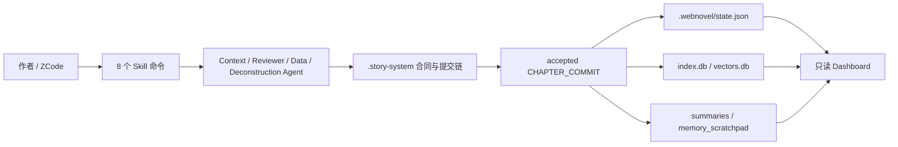

# Webnovel Writer

[](LICENSE)
[](marketplace.json)
[](https://www.python.org/)
[](https://cdn-zcode.z.ai)
[](marketplace.json)

<a href="https://trendshift.io/repositories/22487" target="_blank"></a>

一个跑在 ZCode 上的长篇网文创作插件（v8.0.0「作者主权+300章连贯」：六域书仓治理 + MCP 治理查询 + /webnovel:* 命令）。从初始化设定、规划卷纲，到写章、审查、沉淀记忆、查询状态，再到一个只读的可视化面板——整条创作流程都给你串好了。

它想解决的其实就一件事：**让 AI 写到几百章，依然记得住设定、接得住伏笔、守得住大纲。**

一句话定位：这是一套面向长篇连载的一致性系统，不是写完就忘的一次性生成器。

> **版本导览（2026-09-11 更新，本仓 `lgq-opc/webnovel-writer`）**
>
> 本仓自上游 [lingfengQAQ/webnovel-writer](https://github.com/lingfengQAQ/webnovel-writer) v6.2.1 分叉，之后独立演进到 v7（Story-Repo 书仓）、v7.1（ZCode 原生化）与 v8（作者主权 + 300 章连贯）。上游的 v7/v8 路线与本仓无关。
>
> | 分支 | 版本 | 状态 |
> |---|---|---|
> | `v8-author` | v8.0.0 · ZCode 插件（MCP 12 只读工具 + 13 条 `/webnovel:*` 命令 + 六域书仓治理） | **当前主线**，本 README 描述的即此版本 |
> | `tmp/zcode` | v7.1.0 · ZCode 原生化 | 已并入 v8-author，保留作档案 |
> | `v7-tmp` | v7.0.0 · Story-Repo 书仓迁移 | 已并入 v8-author，保留作档案 |
> | `master` | v6.x · Claude Code 插件基线 | 只修致命 bug，Claude Code 用户可用 |

## 赞助与支持

<a href="https://www.infistar.cc/register?aff=YBE8GGRE&ref_source=link" target="_blank"></a>

**Webnovel Writer × Infistar.cc 无限星河｜全模型 API · 助力长篇网文持续创作**

感谢 [Infistar.cc 无限星河](https://www.infistar.cc/register?aff=YBE8GGRE&ref_source=link) 赞助并为 Webnovel Writer 提供模型服务支持！

- ⚡ **稳定支持长篇连续写作**：提供高可用模型通道与稳定响应，满足大纲规划、章节创作、内容审查、润色改写及长上下文写作等场景。
- 🧠 **兼容 Claude Code 与主流模型**：支持 Claude、ChatGPT、Gemini、Kimi、GLM、DeepSeek 等模型，可灵活配置长篇写作、审查和辅助模型。
- 📚 **助力记忆与知识库检索**：支持 Embedding、Rerank 等兼容 OpenAI 格式的接口，帮助角色设定、时间线、伏笔和章节内容持续沉淀，减少长篇创作中的遗忘与前后矛盾。
- 🎁 **Webnovel Writer 用户专属福利**：通过 [专属推广链接](https://www.infistar.cc/register?aff=YBE8GGRE&ref_source=link) 注册并完成首次调用，即可领取 [5美元等值测试额度 / 首充专属优惠]，快速体验更稳定、更连贯的 AI 长篇创作流程！

Webnovel Writer 用业余时间维护。如果它帮你省下了梳理设定、对齐伏笔的功夫，欢迎来信交流想法、反馈使用体验，或表达对项目的支持：

📮 **ksdflisjdf@gmail.com**

## 为什么需要它

长篇创作最难的不是写出第一章，而是写到第 80 章、第 200 章以后仍然保持：

- 角色动机不漂移
- 战力、时间线、地点和世界规则不互相打架
- 伏笔有登记、有推进、有回收
- 爽点、感情线、世界观扩展保持节奏
- 每章写完后事实会沉淀到可检索的状态系统

这套系统做的事，就是把上面这些“必须记住、不能写崩”的约束，变成 ZCode 会自动执行的步骤：动笔前先查资料，写完后把新发生的事实记下来、做一致性审查，再把最新状态同步进检索索引、章节摘要、长期记忆和 Dashboard。它不只是“会写”，而是边写边攒。

## 核心能力

13 条 `/webnovel:*` 短名命令（薄壳转发到同名 skill 或 CLI；前 8 条也可用 `/webnovel-<name>` skill 名直呼）：

| 能力 | 命令 | 说明 |
|------|------|------|
| 深度初始化 | `/webnovel:init` | 分阶段问答，帮你把书的骨架、设定集、总纲和初始状态搭起来 |
| 卷纲规划 | `/webnovel:plan` | 基于总纲拆卷、拆章、补时间线，并写回新增设定 |
| 章节创作 | `/webnovel:write` | 一条龙写完一章：备上下文、起草（默认双稿择优）、审查、润色、记录事实、自动备份 |
| 质量审查 | `/webnovel:review` | 从爽点、一致性、节奏、OOC、连贯性、文笔（prose_check）等六维审查章节 |
| 状态查询 | `/webnovel:query` | 查询角色、伏笔、节奏、实体关系和运行时信息（只读） |
| 项目学习 | `/webnovel:learn` | 把这本书里好用的写法记下来，存进项目长期记忆 |
| 可视化面板 | `/webnovel:dashboard` | 只读浏览项目状态、实体图谱、章节内容、追读力与治理六视图 |
| 项目体检 | `/webnovel:doctor` | 阶段感知检查目录、文件、数据库、RAG、依赖和 Dashboard 产物 |
| 短状态 | `/webnovel:status` | 书项目阶段、断点、计量一行看 |
| 素材工作台 | `/webnovel:materials` | 素材十表状态 / 装配预览 / 入库三通道 / 卷审 |
| 设定工坊 | `/webnovel:forge` | 境界 / 功法 / 法宝 / 命名四生成器，提案模式（AI 只提议、作者只确认） |
| 战力校验 | `/webnovel:power` | 跨阶依据 / 境界链矛盾 / 通胀曲线 |
| 文风域 | `/webnovel:style` | 文风宪法迁移 / 指纹 / 金句库 |

会话内还自动挂载 `webnovel` MCP 服务（12 个只读工具：where / project_status / doctor / setting_read / timeline_check / meter / knowledge / materials_status / materials_assemble / power_check / foreshadow_scan / reader_signals），供 AI 结构化查询，不暴露写路径。

> **v7 书仓的工具面差异**：`rag_search` 与 `context` 已撤出工具面（D-2 乙，2026-09-13）——前者数据源是 v6 的 `vectors.db`，v7 侧无向量库且补生产等于新建 embedding 子系统；后者已被 `v7-write pack`（上下文包）取代，留着是冗余。`knowledge` 保留但按书仓形态分流：v6 仓答「指定章节的实体状态/关系」，v7 仓答**名册级**信息（正名/别名/首现章）并显式声明未覆盖逐章状态与关系（v7 写链不产这两类数据）。

## 系统长什么样



v6.0.0 的默认主链叫 **Story System**，几个关键角色：

- `.story-system/`：唯一的事实源头，动笔前的“合同”和写完后的“提交”都存在这里
- accepted 的 `CHAPTER_COMMIT`：一章写完，新事实从这里入账
- `.webnovel/state.json`、`index.db`、`summaries/`、`memory_scratchpad.json`：都是从主链派生出来的只读视图，供查询和展示用
- `.webnovel/projection_log.jsonl`：投影执行日志，用来定位 state/index/summary/memory/vector 哪一路没同步
- `project-status`、`doctor`、`preflight` 和 Dashboard 会把主链与运行状态直接摆出来，哪里不对一眼就能看到

## 快速开始

### 1. 安装插件

通过 ZCode 插件市场安装：

1. Settings → Plugin Management → Discover → 点 `+` 添加 marketplace：GitHub 仓库 `lgq-opc/webnovel-writer`（分支 `v8-author`），或本地目录指向本仓库根（上游 `lingfengQAQ` 仓库没有 ZCode 版本，勿用）；
2. 在 Discover 中找到 **webnovel-writer** 点击 **Get** 安装（默认启用）；
3. 重启会话后生效：8 个 skill、4 个 agent、`/webnovel:*` 斜杠命令、`webnovel` MCP 服务自动加载。

> 文件级装卸、缓存与回滚步骤见 [`docs/zcode/zcode-native-adaptation/05-install-reinstall-runbook.md`](docs/zcode/zcode-native-adaptation/05-install-reinstall-runbook.md)。

### 2. 安装 Python 依赖

```bash
python -m pip install -r https://raw.githubusercontent.com/lgq-opc/webnovel-writer/v8-author/requirements.txt
```

### 3. 初始化一本书

在 ZCode 中输入：

```bash
/webnovel:init
```

初始化完成后会创建书项目目录，包含：

```text
project-root/
├── .story-system/        # 合同、章节提交和事件审计
├── .webnovel/            # 状态、索引、摘要、备份和长期记忆
├── 正文/                  # 章节正文
├── 大纲/                  # 总纲、卷纲、时间线和章纲
├── 设定集/                # 世界观、角色、力量体系等设定
└── 审查报告/              # 章节审查报告
```

### 4. 配置 RAG

进入书项目根目录，把 `.env.example` 复制为 `.env` 并填写 API Key：

```bash
cp .env.example .env
```

最小配置：

```bash
EMBED_BASE_URL=https://api-inference.modelscope.cn/v1
EMBED_MODEL=Qwen/Qwen3-Embedding-8B
EMBED_API_KEY=your_embed_api_key

RERANK_BASE_URL=https://api.jina.ai/v1
RERANK_MODEL=jina-reranker-v3
RERANK_API_KEY=your_rerank_api_key
```

没填 Embedding Key 也能用——系统会自动退回 BM25 关键词检索，且不会发出任何网络请求（向量投影跳过，原因 `no_api_key`）；Embedding 和 Rerank 都可以换成任何兼容 OpenAI 格式的接口。数据出网范围详见 [RAG 与配置](docs/guides/rag-and-config.md) 的「数据出网说明」。

### 5. 开始规划和写作

```bash
/webnovel-plan 1      # 规划第 1 卷
/webnovel-write 1     # 写第 1 章
/webnovel-review 1-5  # 审查第 1-5 章
/webnovel-query 伏笔  # 查询项目状态
```

### 6. 打开可视化面板

```bash
/webnovel-dashboard
```

Dashboard 是个只读面板，能看项目状态、实体关系图、章节内容、伏笔和追读力数据。前端是预先打包好的，跟着插件一起发，本地不用跑 `npm build`。

## 写章工作流

> **v6 写链已冻结（frozen-legacy，2026-09-10 退役方案 Phase 1）**：仅维护、不再演进；**新书写章一律走 v7 写链**（即下文）。**新书用 `webnovel.py book-init <目录> <书名>` 直接建 v7 书仓**（不需要先建 v6 再迁移）；既有 v6 书项目先迁移：`migrate_v6_to_v7.py --project-root <v6根> --output <新 v7 书仓>`。

`/webnovel-write` 不是把活儿丢给模型生成一次就完事，而是一条带关卡的完整流水线（v7 书仓）：

1. 预检项目根与占位符；确认本书是 v7 story-repo（有 `book.yaml`）
2. 生成决策卡与上下文包（`v7-write decision` / `pack`）——起草**只以上下文包为依据**
3. 根据上下文包起草正文到 `工作区/草稿-{NNNN}.md`（默认多稿择优）
4. 机检（`v7-write check`）：字数 / 占位符 / 标题 / 承诺
5. 调用 `reviewer` 做多维审查，blocking issue 不通过则阻断
6. 润色、排版、Anti-AI 终检，并跑 `prose-check` 文笔检测
7. 落定（`v7-write settle`）：原子 git commit 正文与章摘要，刷新 v7 缓存，并落账素材轨迹、文风指纹、追读力

这么设计，是为了把“怎么写”和“写了什么”分开：文笔和节奏可以放开发挥，但发生过的事实必须登记、过审、存档，不能含糊。

### 最终报告怎么看

`/webnovel-init`、`/webnovel-plan`、`/webnovel-write` 和 `/webnovel-review` 结束时都会给一份面向作者的最终报告，不直接把内部 JSON、traceback 或长命令日志甩出来。报告先给一句总状态：

- **已完成**：目标产物和关键校验都通过，可以进入下一步。
- **部分完成**：主要产物已保留，但有跳过项、自动处理项或待确认的小尾巴。
- **需要你处理**：系统已经停在安全位置，需要你决定创作方向、事实取舍、是否覆盖文件或如何处理 blocking 问题。
- **未完成**：关键产物没有可信生成，按报告里的恢复建议重跑或排查。

下面固定三段：一是产生的文件与完成情况，二是过程中遇到的问题与异常耗时，三是下一步建议。系统自动处理过的事也会写出来，比如投影失败后已补跑成功；只有不可恢复故障才会提示查看 `.webnovel/logs/run_last.log`。

执行过程中只会看到少量进度提示，告诉你当前在做什么、会产生什么；只有创作方向、事实一致性、文件覆盖风险或 blocking issue 需要裁决时才会问你。重复执行同一条 `/webnovel-write 章号` 时，系统会先检查可信断点，尽量从失败点继续，不重写已经可信完成的正文、审查、提交或备份。

## 内置题材

内置 37 个中文网文题材模板，也支持把几个题材揉在一起写。下面只列一部分：

| 类型 | 题材示例 |
|------|----------|
| 玄幻修仙类 | 修仙、系统流、高武、西幻、无限流、末世、科幻 |
| 都市现代类 | 都市异能、都市日常、都市脑洞、现实题材、电竞、直播文 |
| 言情类 | 古言、宫斗宅斗、青春甜宠、豪门总裁、狗血言情、替身文、种田 |
| 特殊题材 | 规则怪谈、悬疑脑洞、悬疑灵异、历史古代、抗战谍战、知乎短篇、克苏鲁 |

完整列表见 [题材模板文档](docs/guides/genres.md)。

## 命令速查

### ZCode Skill 命令（`/webnovel:*` 短名命令亦可直达）

| 命令 | 示例 | 用途 |
|------|------|------|
| `/webnovel-init` | `/webnovel-init` | 初始化新书项目 |
| `/webnovel-plan` | `/webnovel-plan 1` | 生成卷纲、时间线和章纲 |
| `/webnovel-write` | `/webnovel-write 45` | 写作并提交指定章节 |
| `/webnovel-review` | `/webnovel-review 1-5` | 审查章节范围 |
| `/webnovel-query` | `/webnovel-query 萧炎` | 查询角色、伏笔、状态等信息 |
| `/webnovel-learn` | `/webnovel-learn "这个钩子设计有效"` | 写入项目经验记忆 |
| `/webnovel-dashboard` | `/webnovel-dashboard` | 启动只读可视化面板 |
| `/webnovel-doctor` | `/webnovel-doctor --chapter 12` | 只读体检项目文件、DB、RAG 和依赖 |
| `/webnovel:status` | `/webnovel:status` | 阶段、断点、计量短状态（仅命令形式） |
| `/webnovel:materials` | `/webnovel:materials` | 素材工作台（仅命令形式） |
| `/webnovel:forge` | `/webnovel:forge` | 设定工坊四生成器，提案模式（仅命令形式） |
| `/webnovel:power` | `/webnovel:power` | 战力校验（仅命令形式） |
| `/webnovel:style` | `/webnovel:style` | 文风域：宪法 / 指纹 / 金句库（仅命令形式） |

### CLI 入口

所有命令行工具统一从 `scripts/webnovel.py` 进入：

```bash
python -X utf8 "<ZCODE_PLUGIN_ROOT>/scripts/webnovel.py" --project-root "<PROJECT_ROOT>" <子命令> [参数]
```

常用子命令：

| 子命令 | 说明 |
|--------|------|
| `where` | 打印当前解析出的书项目根目录 |
| `preflight` | 校验插件路径、项目根、Story System 健康状态 |
| `project-status` | 输出机器可读短状态、phase 和下一步 |
| `doctor` | 阶段感知项目体检，给出影响和修复建议 |
| `write-gate` | 写前、提交前、提交后三个自然边界校验 |
| `projections` | 基于已有 commit 补跑或重放投影 |
| `story-system` | 生成合同种子和 runtime contracts |
| `chapter-commit` | 提交章节事实并驱动投影 |
| `story-events` | 查询章节事件或检查事件链健康 |
| `memory` | 查看、查询、导出和回填长期记忆 |
| `rag` | 管理向量索引和检索状态 |
| `status` | 输出项目健康报告 |

v8 治理子命令（书仓六域）：

| 子命令 | 说明 |
|--------|------|
| `domains` | 六域目录契约：`init` 建骨架 / `check` 体检 |
| `author-sync` | 作者手改留账：git diff → 六域分类 → journal + stale（0 token） |
| `materials` | 素材工作台：list / validate / assemble / seed / log / review / apply-ruling |
| `style-domain` | 文风域：migrate 宪法迁移 / fingerprint 指纹 / golden-* 金句库 |
| `learn` | 学习闭环：`learn --from-journal` 卷级归纳 / `apply` 确认回写 / `show` |
| `power` | 战力域：extract / validate 锚点、battle / inflate 账本、check 校验 |
| `forge` | 设定工坊：prepare / save / adopt / confirm / list（提案模式） |
| `prose-check` | 程序化文笔检测六项（高频词 / 长句 / 同句式 / 说明腔…） |
| `drafts` | 多稿择优：record / choose / link / report |
| `promise-ledger` / `foreshadow-scan` | 承诺账本 CRUD；逾期扫描与本章应推进项 |
| `name-check` / `volume-reconcile` | 命名冲突检查；卷纲-实际对账报告 |

更多命令见 [命令详解](docs/guides/commands.md)。

## 文档导航

| 文档 | 内容 |
|------|------|
| [文档中心](docs/README.md) | 所有文档索引和推荐阅读顺序 |
| [系统架构与模块](docs/architecture/overview.md) | 核心理念、Agent 分工、Story System 设计 |
| [命令详解](docs/guides/commands.md) | Skill 命令和 CLI 子命令速查 |
| [RAG 与配置](docs/guides/rag-and-config.md) | 检索流程、环境变量、默认模型 |
| [题材模板](docs/guides/genres.md) | 37 个题材模板和复合题材规则 |
| [项目结构与运维](docs/operations/operations.md) | 目录层级、健康检查、备份恢复 |
| [插件发版](docs/operations/plugin-release.md) | Marketplace 发版和版本同步流程 |

## 开发与测试

克隆仓库后安装依赖：

```bash
python -m pip install -r requirements.txt
python -m pip install -r webnovel-writer/scripts/requirements.txt
```

运行测试：

```bash
python -m pytest
```

Dashboard 前端位于 `webnovel-writer/dashboard/frontend/`，发布版已经包含 `dist/` 构建产物。开发前端时可单独进入该目录执行：

```bash
npm install
npm run dev
```

### 已知限制（自动化验证边界）

- `run_behavior_evals.py --suite fast` 的 23 个 case 是契约层检查（skill frontmatter / 写前提交顺序 / 产物归属 / dashboard 只读等结构性断言），**不覆盖生成内容质量**。
- 承担实际创作与审查判断的两个技能，其 evals 集很薄：`webnovel-write` 仅 3 条、`webnovel-review` 仅 1 条。生成质量目前主要靠 fantasy01 真仓的 1-2 章人工冒烟验证，**没有系统性的自动化质量覆盖**——不要因为「测试全绿」推断生成质量有保障。
- 依赖按 `requirements.lock` 锁定以保证测试可复现；单元测试验证的是代码路径与门禁行为，不是「写到几百章不崩设定」这一核心价值主张本身。

## 排查问题

优先执行预检：

```bash
python -X utf8 "<ZCODE_PLUGIN_ROOT>/scripts/webnovel.py" --project-root "<PROJECT_ROOT>" preflight
python -X utf8 "<ZCODE_PLUGIN_ROOT>/scripts/webnovel.py" --project-root "<PROJECT_ROOT>" doctor --format text
```

重点查看：

- `story_runtime.mainline_ready` 是否为 true
- `.story-system/commits/chapter_XXX.commit.json` 是否存在且 accepted
- `projection_status` 是否全部为 `done` 或 `skipped`
- `index.db`、`summaries/`、`memory_scratchpad.json` 是否正常生成
- RAG API Key 是否已写入书项目根目录的 `.env`

更多运维说明见 [项目结构与运维](docs/operations/operations.md)。

## 贡献

欢迎提 Issue 和 PR。最好用仓库里自带的模板，把复现步骤、环境信息、影响范围和验证方式填一下，也记得先给隐私信息脱敏。

建议流程：

```bash
git checkout -b feature/your-feature
git commit -m "feat: add your feature"
git push origin feature/your-feature
```

适合贡献的方向：

- 新题材模板和题材规则
- 更强的章节审查维度
- Dashboard 信息架构和可视化
- RAG 检索、实体消歧、长期记忆
- Windows/macOS/Linux 兼容性问题
- 文档、示例项目和新手教程

## 更新简介

| 版本 | 主要变化 |
|------|----------|
| **v8.1.0 (当前)** | 40 项缺口四阶段修复：上下文包 7→10 section、settle 三门禁+后置落账、章纲一致性闸、六项数据不变量、doctor 治理体检、面板承诺账本视图、复合题材播种与浮动名扫描 |
| **v8.0.0** | 「作者主权+300章连贯」工程落地（webnovel-copilot-300） |
| **v7.1.0** | ZCode 原生化：.zcode-plugin 清单、webnovel MCP 服务、/webnovel:* 命令、userConfig 书项目根配置 |
| **v7.0.0** | v7 Story-Repo 新架构上线：一键迁移、双格式守卫、两章实跑落定，上下文配额按书校准 |
| **v6.5.0** | Phase C/D 收官：上下文预算实装（−68%）、L0 设定摘要（−93%）、往返压缩与大输出外置化、读侧提速 |
| **v6.4.0** | 写章上下文瘦身：门禁/提交/审查一行结论、load-context 去重（实测 −72%）、中文参数乱码误报修复 |
| **v6.3.0** | 修复伏笔回收、BM25 回退与事件审计链三个核心缺陷（本地发版，详见 releases/v6.3.0.md） |
| **v6.2.1** | 修复 Windows 写章提交偶发的拒绝访问（WinError 5）：资料文件被短暂占用时自动重试 |
| **v6.2.0** | 写章结果更清楚，失败后更好恢复 |
| **v6.1.0** | 插件运行时加固：新增 doctor/project-status/write-gate/projection 重放、hooks、行为 eval 与发布校验 |
| **v6.0.0** | Story System 全链路上线（合同种子 + 运行时合同 + 章节提交 + 事件审计），补齐集成测试 |
| **v5.5.5** | 长期记忆闭环：写前注入 + 写后沉淀，新增 `memory` 运维命令 |
| **v5.5.4** | 写作链提示词强约束，统一中文化审查和报告文案 |
| **v5.5.3** | 统一 `preflight` 预检命令，修复 Windows 终端编码问题 |
| **v5.5.2** | 大纲章节名同步到正文文件名 |
| **v5.5.1** | 修复卷级大纲上下文提取，补齐 Dashboard 和 Learn 命令文档 |
| **v5.5.0** | 新增只读可视化 Dashboard，支持实时刷新 |
| **v5.4.4** | 接入 Plugin Marketplace 安装机制 |
| **v5.4.3** | 增强 RAG 智能上下文（`auto/graph_hybrid` 回退 BM25） |
| **v5.3** | 引入追读力系统（Hook / Cool-point / 微兑现 / 债务追踪） |

## 开源协议

本项目使用 [GPL v3](LICENSE) 协议。

## Star 历史

[](https://star-history.com/#lingfengQAQ/webnovel-writer&Date)

## 致谢

本项目使用 Claude Code、Gemini CLI 与 Codex 配合 Vibe Coding 方式开发。

灵感来源：[Linux.do 帖子](https://linux.do/t/topic/1397944/49)

感谢 `oh-story-claudecode` 提供拆文流程参考。
