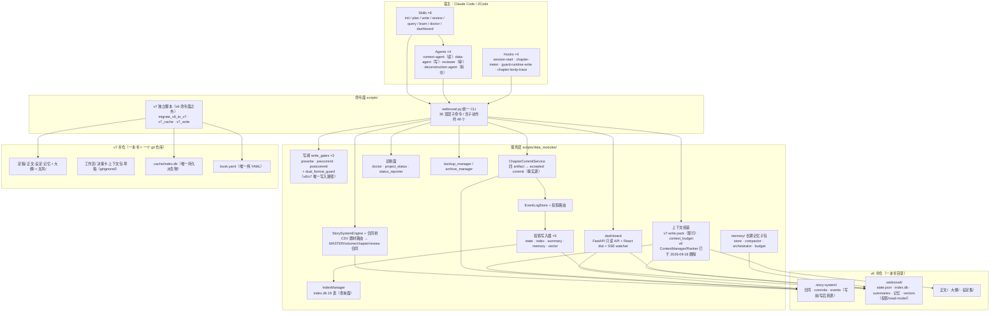
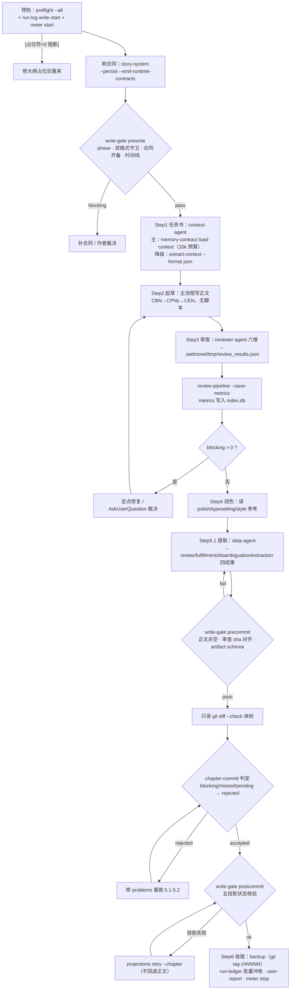
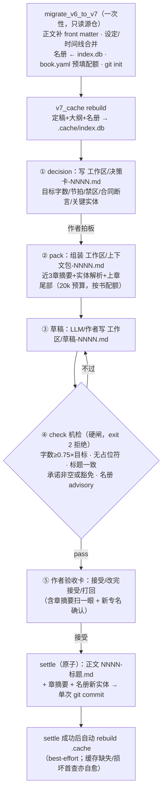
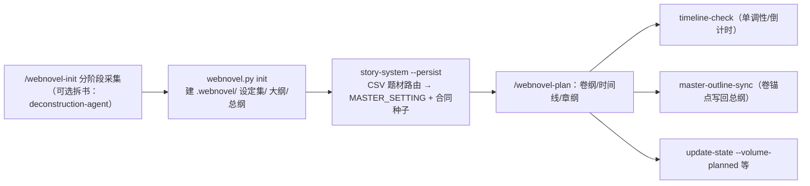
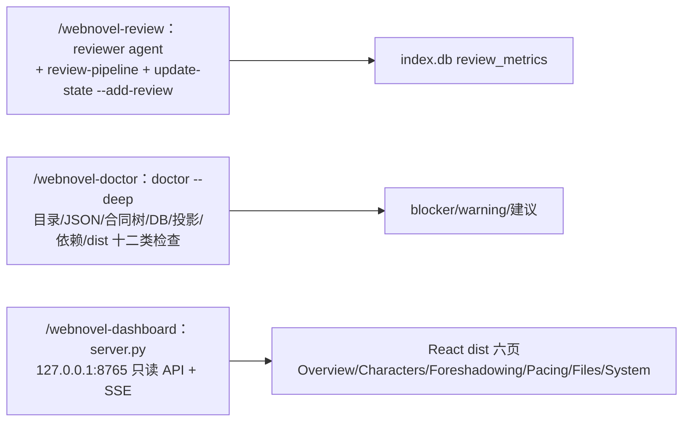
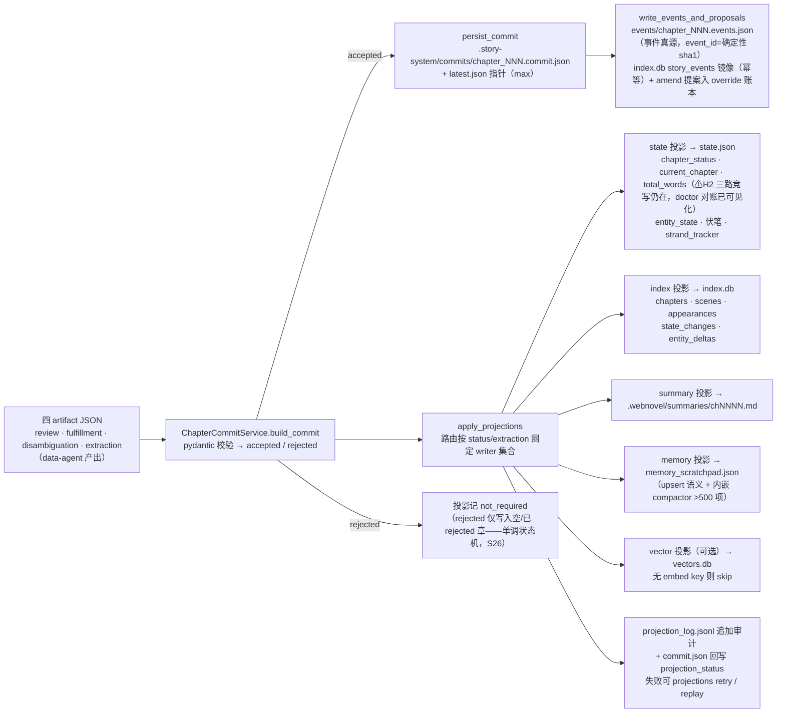
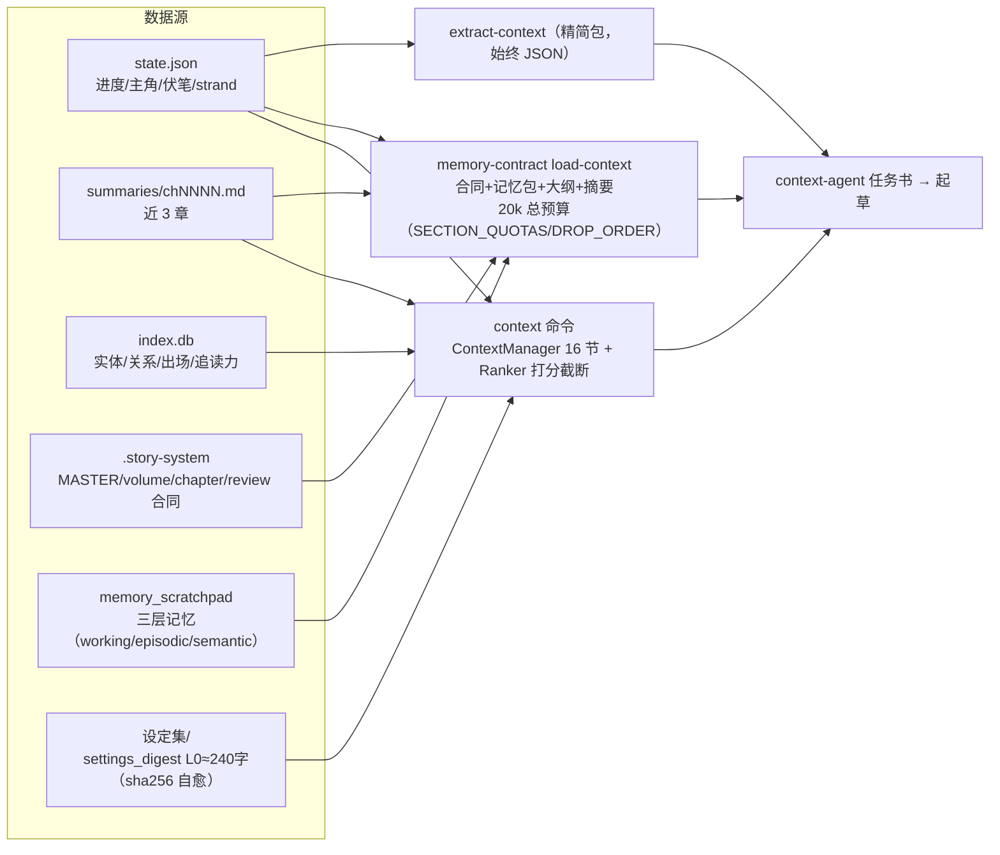
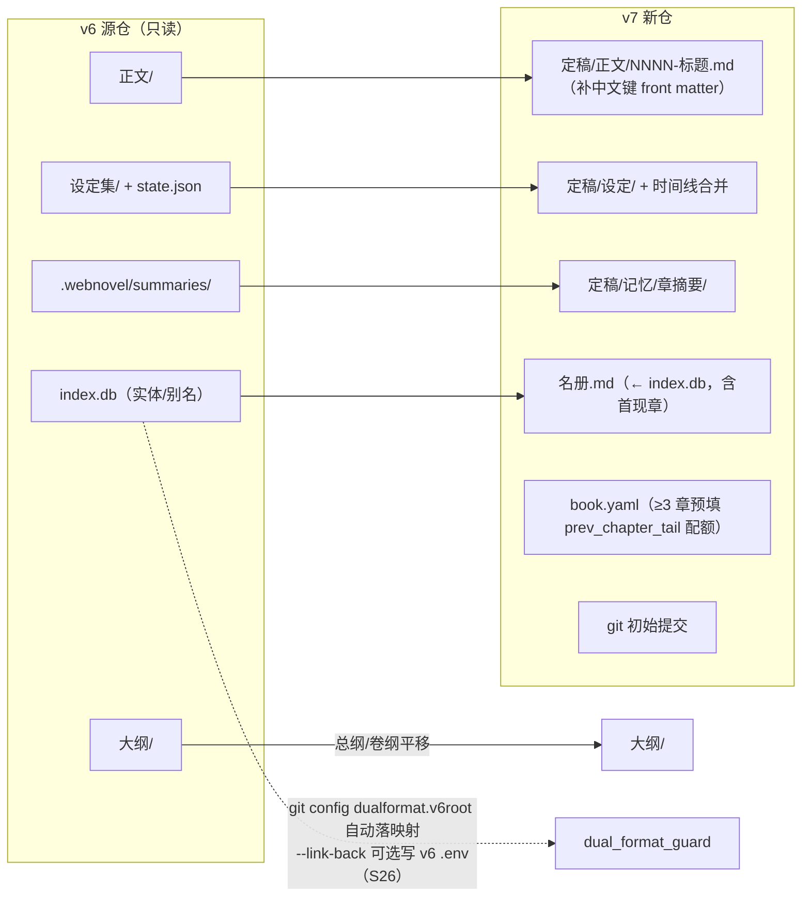

# 功能流程与数据流全景（v6.3 + v7.0）

> 定位：一份**当前实现**的全景图——功能怎么串、数据落在哪、谁是真源谁是派生。面向维护者/审阅者，作为 [overview](overview.md)（v6 理念层）与 [story-repo-spec](story-repo-spec-2026-06-10.md)（v7 法律文本）之间的「实况层」。
> 基线：`@7e3bfe2`（2026-09-02）+ P1/P2/P3 修复批（S25/S26，同日）。图中标注「⚠审阅」处为 [增量审阅报告](../reports/2026-09-02-增量代码审阅报告.md) 的遗留缺陷位置（S26 后仅剩 H2 写入语义与个别需改前端 dist 的项，理由见报告 §4），属当前实现实况。

## 1. 总体架构分层

要点：

- **v6 链路**：Skills/Agents 全部经统一 CLI 进服务层；`.story-system/` 是真源（合同→commit→事件），`.webnovel/` 全部是投影/read-model（[overview](overview.md) 的真源划分）。
- **v7 链路**：三脚本独立于 v6 命令面，直接以 Markdown + git 为中心，唯一派生物是 `.cache/index.db`。
- **双链收口**：`dual_format_guard` 是两链路间互斥机制——迁移器自动落 `git config dualformat.v6root` 映射（settle 兜底读取）、prewrite/precommit 双挂载、v6 侧经可选 `--link-back` 写 .env 激活（S26 接线）。

## 2. 功能域与命令面速查

| 功能域 | 入口 | 读写 |
|---|---|---|
| 环境定位 | `where` / `use` / `preflight [--all]` / `project-status` | 指针+只读体检 |
| 初始化 | `webnovel.py init`（40+ 采集项）+ `story-system`（种子合同） | 建目录/合同 |
| 规划 | `timeline-check` / `master-outline-sync` / `update-state` / `story-system --emit-runtime-contracts` | 大纲+state |
| 上下文 | `v7-write pack` + `setting-read`（现行）；`context` / `extract-context` 已于 2026-09-18 级联删除 | 只读 |
| 检索 | `knowledge query-entity-state·query-relationships` / `index ·` 30+ 子命令 / `rag` | 只读 index.db |
| 写章 | `write-gate --stage {prewrite,precommit,postcommit}` | 门禁快照 |
| 提交 | `chapter-commit`（四 artifact）/ `projections retry·replay` | commits+投影 |
| 审查 | `review-pipeline` / `story-events` | metrics 入库 |
| 记账 | `run-log` / `run-ledger` / `meter` / `user-report` | 台账 |
| 运维 | `backup` / `archive` / `migrate` / `status` / `doctor [--deep]` / `project-memory add-pattern` | 备份/归档/体检 |
| v7 | `migrate_v6_to_v7` / `v7_cache rebuild·verify·snapshot` / `v7_write decision·pack·check`（settle 仅 Python API） | v7 书仓 |

## 3. 核心功能流程图

### 3.1 `/webnovel-write` 写一章（v6 主链）

充分性闸门（SKILL 约定）：正文非空 / 审查落库 / blocking 处理 / anti-AI 通过 / commit=accepted 且五投影 done·skipped / chapter_status=committed / 三道 gate 全过——任一不满足不得声称完成。

### 3.2 v7 写一章（story-repo 新架构）

v7 与 v6 的本质差异：**没有中间投影层**——正文/摘要/名册直接是定稿文件，git commit 即事务边界，`.cache` 可随时删（S25 后 settle 自动刷新、损坏自愈）。

### 3.3 初始化与规划

### 3.4 审查 / 诊断 / 面板

## 4. 数据流

### 4.1 v6 章节提交数据流（写路径核心）

旁路写链（不走 commit）：`webnovel.py state process-chapter` → `StateManager.process_chapter_result` → FileLock + 锁内重读合并写 state.json → 增量同步 index.db（失败保留 pending 待重试）。

### 4.2 读路径：上下文组装（v6，2026-09-18 已级联删除）

> 2026-09-18 §3.1 第 4 条：在役写链改指 `v7-write pack`（见 §4.3）后，已删除 `context` / `extract-context` CLI 与 `context_manager` / `context_ranker` / `extract_chapter_context.py`。下图是删除前的 v6 装配链，仅作考古。

### 4.3 v7 读路径

`v7_write pack` ← `book.yaml`（预算）+ `.cache` 的 `get_summary`（近 3 章）/ `find_entity`（决策卡关键实体，正名+别名模糊）+ 名册目录扫描（候选新实体）+ 上章正文尾部 + 全书字数统计。查询面三 API 均短连接直读 `.cache/index.db`（4 表：chapters/entities/summaries/meta）。

### 4.4 数据落点全景（真源 / 投影 / 派生标注）

**v6 书仓**

| 落点 | 格式 | 角色 | 写者 | 读者 |
|---|---|---|---|---|
| `正文/第N章-*.md` | Markdown | 内容真源 | 主流程/作者 | commit 链、backup、dashboard |
| `大纲/`（总纲/卷/时间线） | Markdown | 意图真源 | init/plan/master-outline-sync/作者 | context、story-system、timeline-check |
| `设定集/*.md` | Markdown | 设定真源 | init/作者 | settings_digest → context |
| `.story-system/MASTER_SETTING.json`、`volumes/`、`chapters/`、`reviews/` | JSON | **写前真源（合同）** | story-system 引擎 | prewrite 闸、context、dashboard |
| `.story-system/commits/chapter_NNN.commit.json` + `latest.json` | JSON | **写后真源（事实）** | ChapterCommitService | postcommit 闸、projections、dashboard、memory 契约 |
| `.story-system/events/chapter_NNN.events.json` | JSON | **事件真源（审计）** | commit 链 | story-events、dashboard |
| `.webnovel/state.json`(+.lock) | JSON | 投影 | state 投影 / StateManager / update_state | context、dashboard、doctor（FileLock+原子写） |
| `.webnovel/index.db`（19 表） | SQLite | 投影/查询面 | index 投影、EventLogStore、review-pipeline、archive | knowledge、dashboard、status_reporter、context |
| `.webnovel/summaries/chNNNN.md` | Markdown | 派生 | summary 投影 | context、memory orchestrator、bootstrap |
| `.webnovel/memory_scratchpad.json`(+.lock) | JSON | 派生（长期记忆） | memory 投影 / process_chapter | orchestrator、status_reporter（内嵌 compactor） |
| `vectors.db` / `rag.db` | SQLite | 派生（可选） | vector 投影 / RAGAdapter | rag_adapter（无 key 自动降级 BM25） |
| `.webnovel/projection_log.jsonl` | JSONL | 审计 | append_projection_run | postcommit 闸、doctor、dashboard |
| `.webnovel/run_ledger.json` | JSON | 台账 | run-ledger 命令 | 断点续跑（锁内原子写，S26） |
| `.webnovel/logs/run_last.log`、`observability/*.jsonl`、`logs/chapter_body_trace.log` | 日志 | 观测 | run-log / data-agent / hook | 排障 |
| `.webnovel/tmp/`（gate 快照、review_results.json、meter 标记） | JSON | 瞬态 | 闸/审查/计量 | 各自消费方 |
| `.webnovel/backups/`、git tag `chNNNN` | git/快照 | 备份 | backup_manager | 回滚/diff |
| `.webnovel/archive/*.json` | JSON | 冷存 | archive_manager | 按名恢复 |

**v7 书仓**

| 落点 | 格式 | 角色 | 写者 | 读者 |
|---|---|---|---|---|
| `book.yaml` | YAML | 配置（唯一纯 YAML） | 迁移器/作者 | pack 预算、cache meta |
| `定稿/正文/NNNN-标题.md`（中文键 front matter） | Markdown | **真源** | 仅 settle | cache rebuild、pack 尾部、字数统计 |
| `定稿/记忆/章摘要/NNNN.md` | Markdown | 真源 | settle（作者可改） | cache、下章 pack |
| `定稿/设定/名册.md` + `名册/<正名>.md` | Markdown | 真源（双落点） | 迁移器写单表；settle 写目录 | cache 兼读（目录优先，含首现章列） |
| `定稿/设定/`（角色/时间线/世界观） | Markdown | 真源 | 迁移器/作者 | （v7.0 尚无程序化读） |
| `大纲/`、`文风/` | Markdown | 作者意图 | 作者（v7.0） | 未来 pack 扩展 |
| `工作区/`（决策卡/上下文包/草稿） | Markdown | 瞬态（gitignored） | v7_write、LLM | 作者界面、机检 |
| `.cache/index.db`（4 表） | SQLite | **唯一派生缓存** | rebuild_cache（settle 后自动/首查触发） | 查询面三 API（可随时删；缺失/损坏首查自愈） |

### 4.5 hooks 数据流

| Hook | 触发 | 数据流 |
|---|---|---|
| session-start | SessionStart | 子进程跑 `project-status --format summary` → 裁剪注入上下文（可 env 关闭） |
| chapter-meter | UserPromptSubmit | 读 `.webnovel/tmp/chapter_meter.json`（status=open）→ 聚合 ZCode 用量库 → 注入「本章累计」 |
| guard-runtime-write | PreToolUse(Write/Edit/Bash) | deny 对 `commits/`、`index.db`、`vectors.db`、`memory_scratchpad.json`、`projection_log.jsonl` 的直写（拦截名单含 cp/mv/tee/sed -i/dd/git checkout，S26） |
| chapter-body-trace | PostToolUse(Write) | `正文/` 落笔 → 追加 JSONL 审计 |

### 4.6 v6 → v7 迁移数据流（一次性）

映射表完整版见 spec §12。旧 `state.json`/事件链/投影在 v7 侧**不迁移**（spec 不做清单），事实只保留定稿文件承载的部分。

## 5. 守卫与不变量的实现落点

| 不变量（spec/设计） | 实现落点 | 现状 |
|---|---|---|
| 机检先于模型评审 | v7 `check` 硬闸 exit 2；v6 prewrite/precommit | ✅ 两章实测有效 |
| 结转原子性（要么完成要么原样） | v7 settle 回滚；v6 commit+projection retry | ✅（S26：unlink 逐文件保护 + reset 范围化） |
| 派生物可丢弃、首查重建 | `v7_cache._conn` / `projections replay` | ✅（S25 后：settle 自动刷新 + 缺失/损坏首查重建） |
| 唯一写入路径（v6/v7 互斥） | `dual_format_guard` + prewrite/precommit/settle 挂载 | ✅（S26 接线） |
| 定稿只增不改 | settle 仅新建文件 + git（章号前缀判重） | ✅ |
| 容错读取（未知字段保留） | 各 schema 解析器（名册目录单文件损坏跳过） | ✅ |
| 状态写入受锁保护 | FileLock + 原子写（state/scratchpad/run_ledger） | ✅ |
| 运行时数据防直写 | guard_runtime_write hook | best-effort（拦截名单已补齐） |
